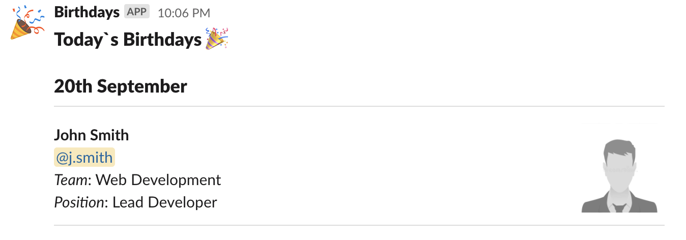

# Birthday Webhook APP for Slack

This app will daily post information about the employees' birthdays

## Requirements

- Data Endpoint

    A json data endpoint is needed where information of the employees will be retrieved from. Employee information needed is the following:

        - birthday: `birthday`, eg. Jul 22
        - SlackId: `slack_id`, eg: 3474X3902
        - Display name: `display_name`, eg. John Smith
        - Team: `department`, eg. Web Development
        - Job Title: `title`, eg. Lead Developer 
        - Image: `image_192`, public url to employee's image
    
    This endpoing needs to be configured in the config.py file

- Slack Configuration

    Create an App with a webhook configuration. Set the webhook endpoint in the config.py file

## Output Example

